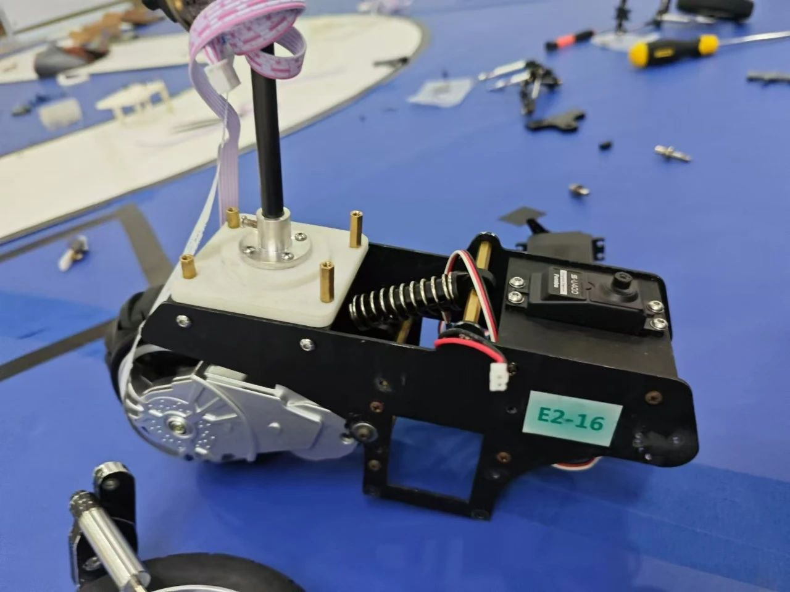
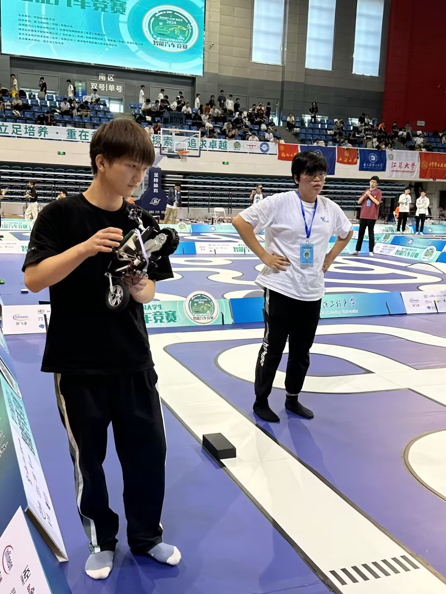
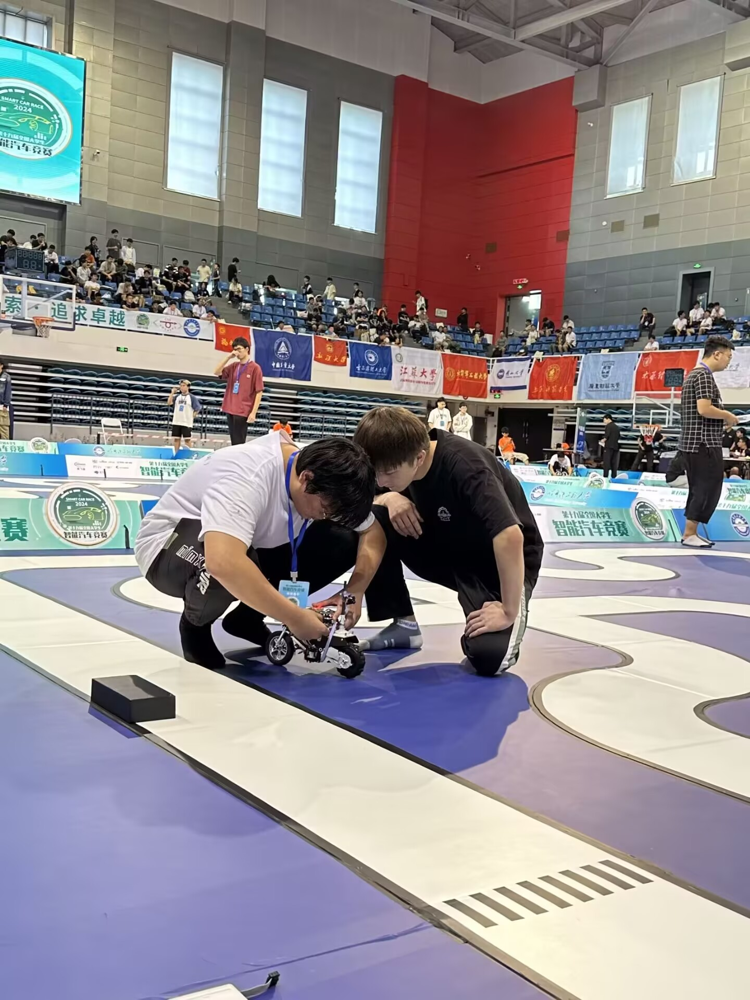
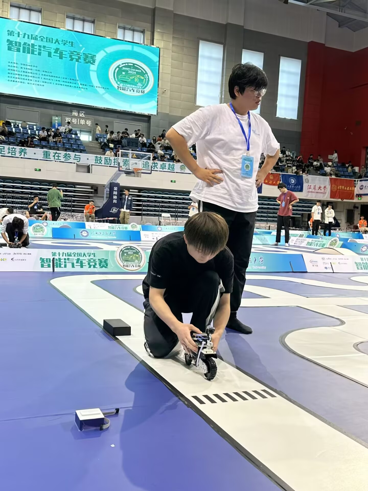

# TLD7002_TC264_Demo — 智能摩托车控制系统

**第十九届全国大学生智能汽车竞赛 · 摩托组 · 全国一等奖**

---

## 硬件平台

- **主控芯片**: Infineon TC264 (Tricore 双核, 200MHz)
- **姿态传感器**: ICM-20602 (6轴 IMU: 加速度计 + 陀螺仪)
- **视觉传感器**: 总钻风摄像头
- **电机驱动**: DRV8701 + MOS 管 H 桥
- **LED 驱动**: TLD7002 (Infineon LED 阵列驱动)
- **编码器**: 增量式旋转编码器
- **无线调试**: IPS200 屏幕 + 按键菜单

## 软件架构

```
├── user/           # 用户层主程序入口
│   ├── cpu0_main.c    # CPU0 主程序 (姿态解算 + 平衡控制)
│   ├── cpu1_main.c    # CPU1 主程序 (图像处理 + 路径识别)
│   └── isr.c          # 中断服务程序
├── code/           # 核心算法层
│   ├── C_H.c          # 图像处理 (5300+ 行)
│   ├── QuaternionEKF.c # 扩展卡尔曼滤波四元数姿态解算
│   ├── kalman filter.c # 卡尔曼滤波器
│   ├── Attitude.c      # 姿态角计算
│   ├── PID.c           # PID 控制器
│   ├── encoder.c       # 编码器里程计
│   ├── Fit.c           # 斜率拟合
│   ├── matrix.c        # 矩阵运算库
│   ├── TLD.c           # TLD7002 LED 灯光秀状态机
│   ├── menu_simp.c     # 参数调试菜单
│   ├── initial.c       # 外设初始化
│   └── ips200.c        # IPS200 屏幕显示
└── libraries/      # Infineon 官方库
    ├── iLLD/           # Infineon 底层驱动库
    └── zf_driver/      # 逐飞外设驱动库
```

## 核心算法

### 1. 扩展卡尔曼滤波 (EKF) 四元数姿态解算
- 使用四元数表示姿态，避免欧拉角万向节死锁
- EKF 融合加速度计 + 陀螺仪数据
- 实时输出 Roll / Pitch / Yaw 姿态角

### 2. 三串级 PID 差速平衡控制
- **角度环**: 保持车体平衡 (内环)
- **角速度环**: 阻尼振荡 (中环)  
- **速度环**: 跟踪目标速度 (外环)
- 差速转向控制

### 3. 视觉识别与路径规划
- 摄像头灰度图像采集与二值化
- 赛道边缘提取与中线拟合
- 弯道识别与预处理
- 十字路口检测

### 4. TLD7002 灯光秀
- Infineon TLD7002 LED 阵列驱动器控制
- 状态机实现动态灯光效果

## 关键技术指标

| 指标 | 参数 |
|------|------|
| 姿态更新频率 | 1kHz |
| 控制周期 | 1ms |
| 图像处理帧率 | 50fps |
| 平衡精度 | ±1° |
| 最高速度 | 2.5 m/s |

## 获奖情况

- **第十九届全国大学生智能汽车竞赛 — 摩托组**
- **全国一等奖**
- 证书：[智能车国一等奖.pdf](../智能车国一等奖.pdf)

## 演示视频与照片

### 比赛现场视频
- [国赛比赛现场.mp4](demo_media/国赛比赛现场.mp4)

### 实验室调试视频
- [国赛前实验室调试.mp4](demo_media/国赛前实验室调试.mp4)

### 实车照片

| 结构调整 | 调试场景1 | 调试场景2 | 发车瞬间 |
|----------|----------|----------|----------|
|  |  |  |  |
